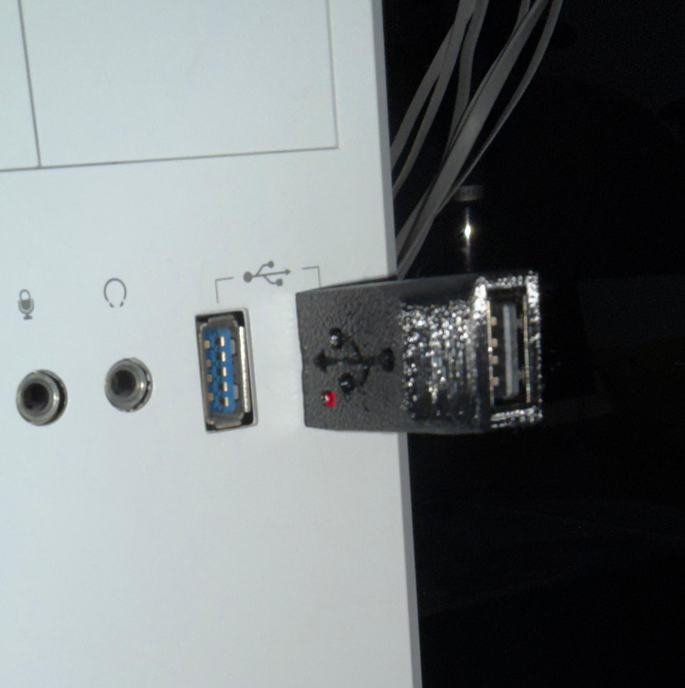
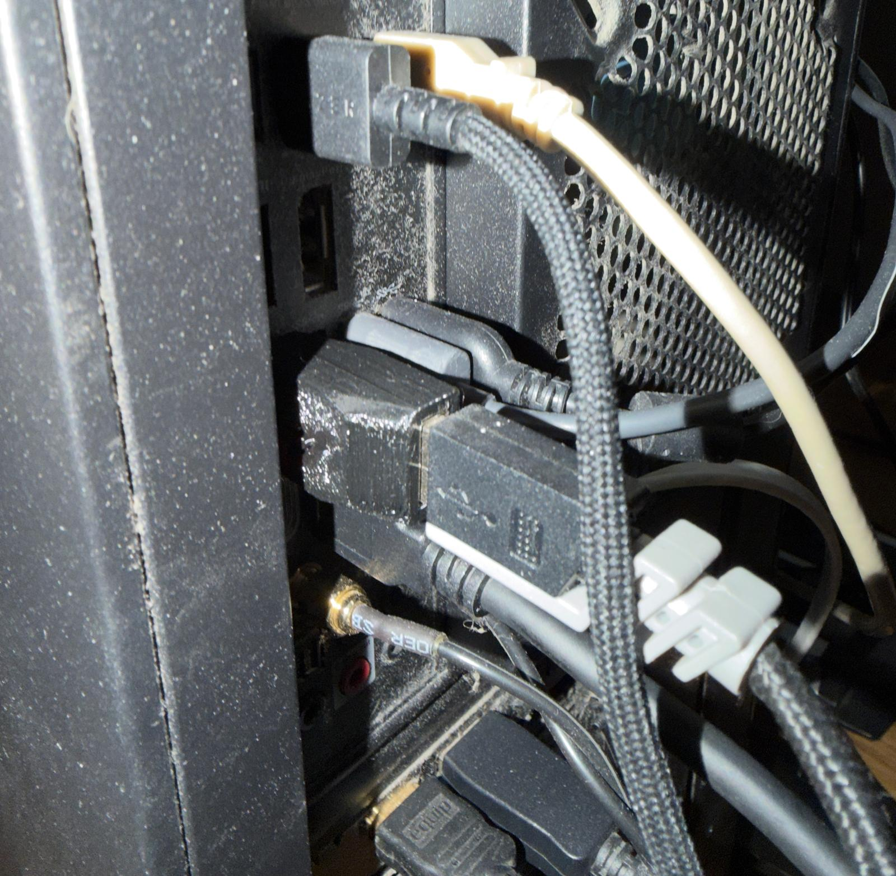
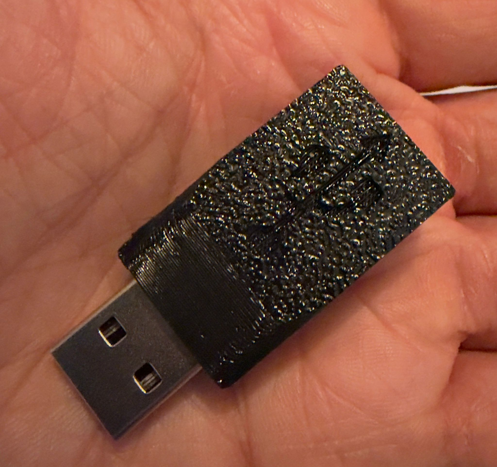
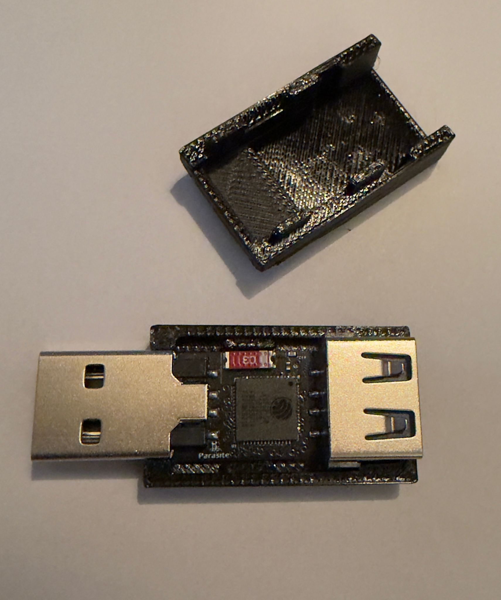
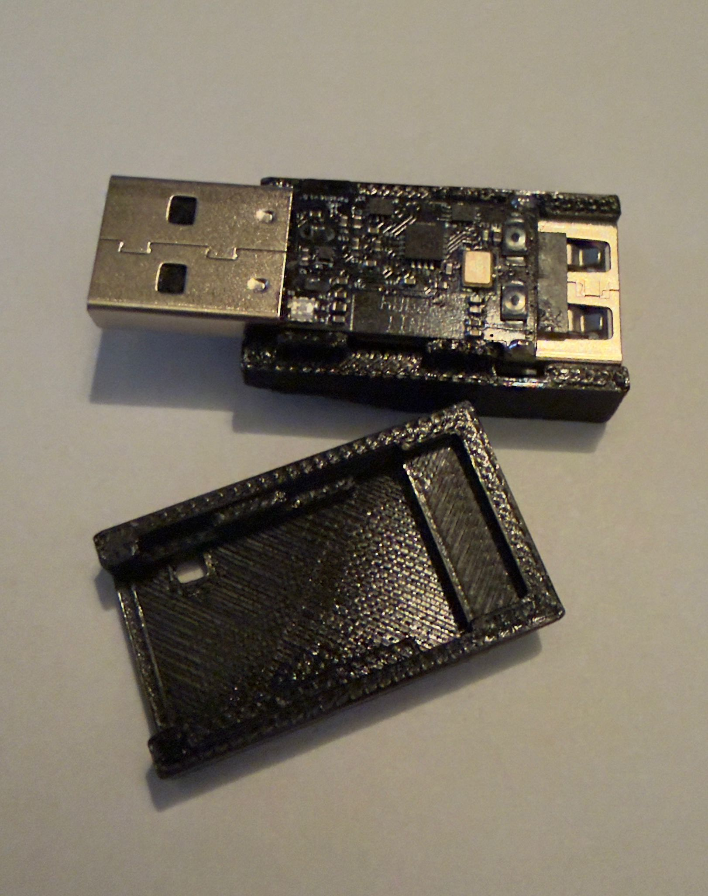
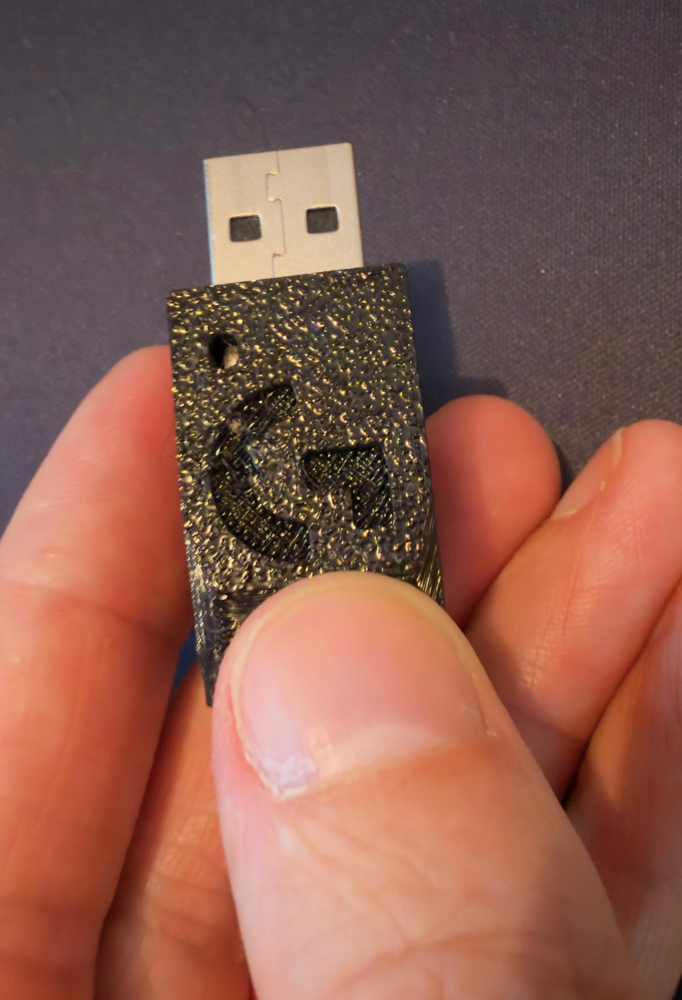
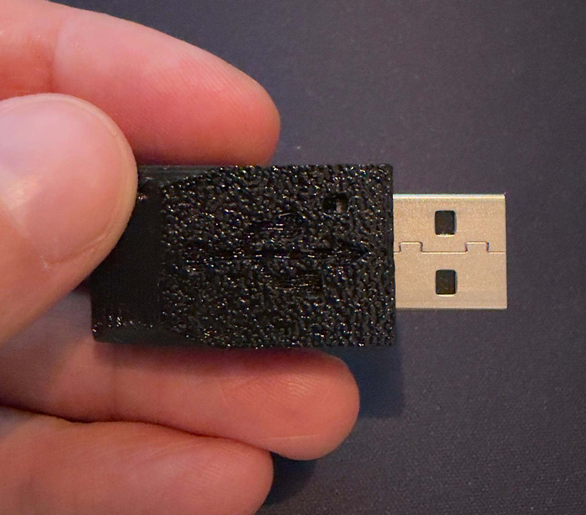

# Diabolic Parasite Case - 3D Printed made by Ser0ka88

**This enclosure was fully designed and created as a contribution to Diabolic Parasite users by the talented and amazing Ser0ka88. I highly recommend working with him if you need any 3D printing designs. My experience was excellent—he is very professional, very fast, and knows exactly what he’s doing. This enclosure took less than a couple of hours to complete, and I was truly amazed by how fast and professional he is. A huge thanks to him!**

Github: <https://github.com/Ser0ka88>

Discord: ser0ka

</h1>

## Pictures
<table>
  <tr>
    <td></td>
    <td></td>
    <td></td>
  </tr>
  <tr>
    <td></td>
    <td></td>
    <td></td>
  </tr>
  <tr>
    <td></td>
    <td></td>
    <td></td>
  </tr>
</table>

</h1>

## Print Settings / Info

Material used: PETG

Nozzle size: 0.4

Quality: 0.16 mm high quality

Support structures: None

**The material is not a "must."**

## About

The housing was modeled in Autodesk Fusion and adapted as best as possible to the dimensions of the Diabolic Parasite. Due to the offset between the USB male and USB female connectors, the housing is unfortunately slightly thicker than standard USB devices.
Both housing parts can be printed without support structures and, when printed with a perfectly calibrated printer, fit together so well that no gluing is necessary.

The 3D models may be modified. However, it would be desirable to mention the author.

